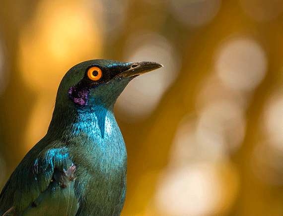

# Bokeh Effect

Bokeh is defined as “the effect of a soft out-of-focus background that you get when shooting a subject, using a fast lens, at the widest aperture, such as f/2.8 or wider.” Simply put, bokeh is the pleasing or aesthetic quality of out-of-focus blur in a photograph.

<small>Example of the Bokeh effect, end result on your image might be different</small>

## Sample Usage

    

    <!-- Add on:segmentation="{onSegmentation}" if you want access to the raw data -->
    <BokehEffect image="{camRef}" outputCanvas="{testCanvas}" />

    <!-- Bind your testCanvas -->

## API

| Parameter                | Type                                                               | Description                                                                                                                         |
| ------------------------ | ------------------------------------------------------------------ | ----------------------------------------------------------------------------------------------------------------------------------- |
| **backgroundBlurAmount** | _number_                                                           | How many pixels in the background blend into each other. Defaults to 3. Should be an integer between 1 and 20.                      |
| **edgeBlurAmount**       | _number_                                                           | How many pixels to blur on the edge between the person and the background by. Defaults to 3. Should be an integer between 0 and 20. |
| **flipHorizontal**       | _boolean_                                                          | If the output should be flipped horizontally. Defaults to false.                                                                    |
| **outputCanvas**         | _HTMLCanvasElement_                                                | The HTML Canvas where the end effect will be rendered                                                                               |
| **image**                | _ImageData, HTMLImageElement, HTMLCanvasElement, HTMLVideoElement_ | The element that houses the image to be processed                                                                                   |

## Events

| Parameter                | Type    | Description                                                                                            |
| ------------------------ | ------- | ------------------------------------------------------------------------------------------------------ |
| **on:segmentation**      | _event_ | Segmentation object with the output from Body Pix's segmentPerson method.                              |
| **on:complete**          | _event_ | This is triggered only when the segmentation and the bokeh effect has been applied to the outputCanvas |
| **on:modelLoadStarted**  | _event_ | Lifecycle event, can be useful for rendering 'loading' state before the model is executed              |
| **on:modelLoadFinished** | _event_ | Lifecycle event, can be useful for rendering 'loading' state before the model is executed              |

## Model Information

If you want more information on the model and the segmentation therein.

https://github.com/tensorflow/tfjs-models/tree/master/body-pix
